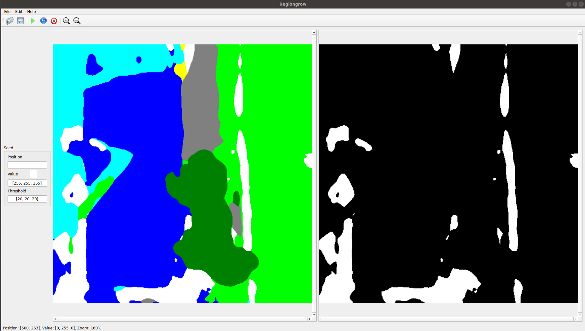

[](https://github.com/lh9171338/Outline) Region Growing
===
This repository is the region growing algorithm implemented with PyQt5.

## UI



## Requirements

* PyQt5
* numpy, cv2, yacs

```shell
pip install -r ./requirements.txt
```

## Usage
```shell
python Regiongrow.py
```

