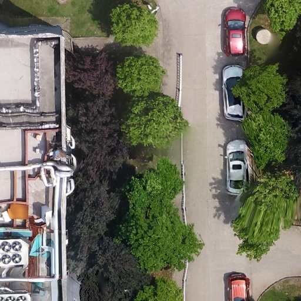

[](https://github.com/lh9171338/Outline) Region Growing
===

# Introduction

This repository is the region growing algorithm implemented with PyQt5.

# UI

<p align="center">
  
</p>

# Result

<p align="center">
  
   
  <br>   
  
  
  <br>Input (left) and output (right) images
</p>

# Requirements

* PyQt5
* numpy, cv2, yacs

```shell
pip install -r ./requirements.txt
```

# Usage
```shell
python Regiongrow.py
```

